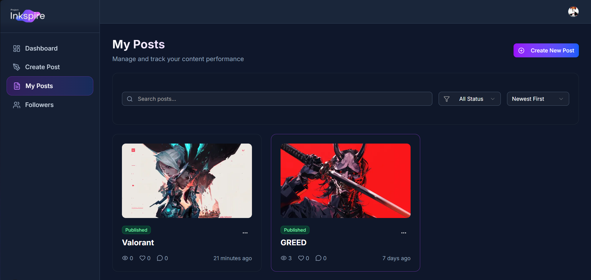
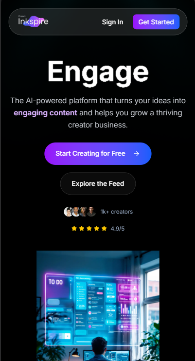
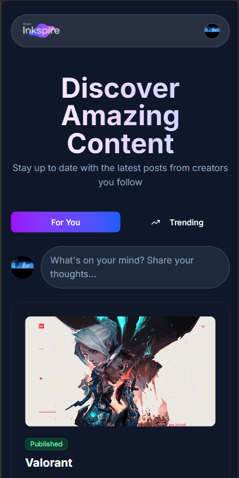
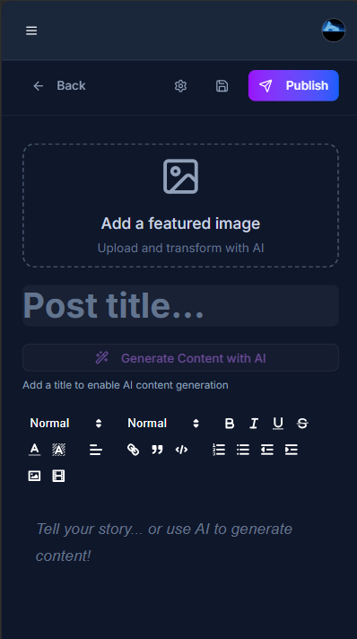

# Inkspire - AI Content Platform

<p align="center">
	
</p>

<p align="center">
	<a href="./LICENSE"></a>
	<a href="https://github.com/AmjustGettingStarted/Inkspire/issues"></a>
	<a href="https://github.com/AmjustGettingStarted/Inkspire/stargazers"></a>
</p>

<p align="center"><b>Inkspire: Ignite Your Creativity!</b></p>

---

## Overview

**Inkspire** is a next-generation creator platform for writers, artists, and thinkers. Capture, organize, and share your ideas with a beautiful, modern, and responsive UI. Built with the latest web technologies for a seamless experience.

---

## Folder Structure

```text
Inkspire/
├── app/                # Next.js app directory (routing, pages, layouts)
│   ├── (auth)/         # Authentication (sign-in, sign-up, layouts)
│   ├── (public)/       # Public-facing pages (user profiles, feed)
│   ├── dashboard/      # User dashboard (posts, followers, settings)
│   ├── actions/        # Server actions (e.g., AI, Gemini)
│   ├── api/            # API routes (e.g., image uploads)
│   ├── globals.css     # Global styles (Tailwind, custom CSS)
│   └── layout.js       # Root layout
├── components/         # Reusable React components
│   ├── ui/             # UI primitives (button, card, dialog, etc.)
│   └── reactbits/      # Visual/animated effects (Aurora, Particles, etc.)
├── convex/             # Convex backend functions (database, auth, etc.)
├── hooks/              # Custom React hooks
├── lib/                # Utility libraries (data, imagekit, helpers)
├── public/             # Static assets (banner, logo, images)
├── .clerk/             # Clerk authentication config
├── package.json        # Project metadata & dependencies
├── jsconfig.json       # JS path aliases
├── next.config.mjs     # Next.js configuration
├── postcss.config.mjs  # PostCSS/Tailwind config
├── eslint.config.mjs   # ESLint configuration
└── README.md           # Project documentation
```

---

## Features

- Modern, responsive UI/UX (desktop & mobile)
- Light & dark themes
- Rich text post editor
- AI-powered features (Google Gemini integration)
- Image uploads (ImageKit)
- Social features: followers, likes, comments
- Dashboard analytics (charts, stats)
- Authentication (Clerk)
- Realtime database (Convex)
- Modular, scalable codebase

---

## Tech Stack & What They Do

| Technology                        | Purpose in Project                                                           |
| --------------------------------- | ---------------------------------------------------------------------------- |
| **Next.js**                       | React framework for SSR, routing, and app structure                          |
| **React 19**                      | UI library for building interactive components                               |
| **Convex**                        | Realtime backend/database, serverless functions                              |
| **Clerk**                         | Authentication, user management                                              |
| **Tailwind CSS**                  | Utility-first CSS framework for rapid UI development                         |
| **Radix UI**                      | Accessible, unstyled UI primitives (dialogs, dropdowns, sliders, tabs, etc.) |
| **Zod**                           | TypeScript-first schema validation                                           |
| **React Hook Form**               | Form state management and validation                                         |
| **ImageKit**                      | Image uploads and CDN                                                        |
| **Google Gemini API**             | AI-powered content generation                                                |
| **Chart.js + react-chartjs-2**    | Data visualization (dashboard analytics)                                     |
| **Lucide/Tabler Icons**           | Icon libraries for UI                                                        |
| **Three.js & OGL**                | 3D graphics and visual effects                                               |
| **Sonner**                        | Toast notifications                                                          |
| **date-fns**                      | Date utilities                                                               |
| **clsx/class-variance-authority** | Conditional class management                                                 |
| **next-themes**                   | Theme switching (light/dark)                                                 |

---

## Installation

```bash
git clone https://github.com/AmjustGettingStarted/Inkspire.git
cd Inkspire
npm install
npm run dev
```

---

## Usage

1. Start the dev server: `npm run dev`
2. Visit [http://localhost:3000](http://localhost:3000)
3. Sign up or sign in to your account
4. Create, edit, and share your posts!

---

## Screenshots

<!-- Add screenshots to public/ and update the paths below -->
<p align="center">
	
	
</p>
<!-- Mobile view screenshots -->
<p align="center" style="
  display: flex;
  justify-content: center;
  align-items: center;
  gap: 10px;
  flex-wrap: nowrap;
">
  
  
  <!--  -->
</p>

---

## Roadmap

- [ ] Collaborative editing
- [ ] More AI-powered features
- [ ] Enhanced analytics
- [ ] Mobile app

---

## Contributing

We welcome contributions! Please see [CONTRIBUTING.md](./CONTRIBUTING.md) for guidelines.

---

## License

MIT License  
[LICENSE](./LICENSE).

---

<p align="center"><i>Designed with ❤️ by <a href="https://github.com/AmjustGettingStarted">AmjustGettingStarted</a></i></p>
